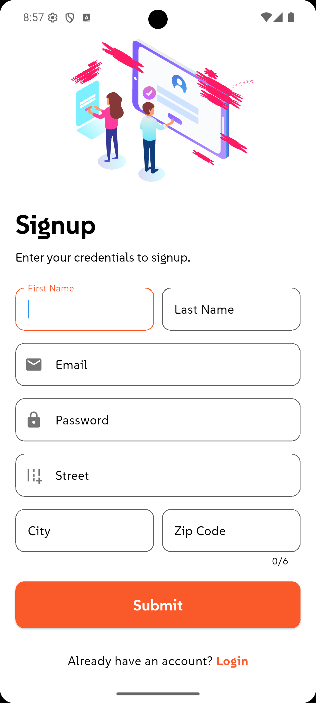
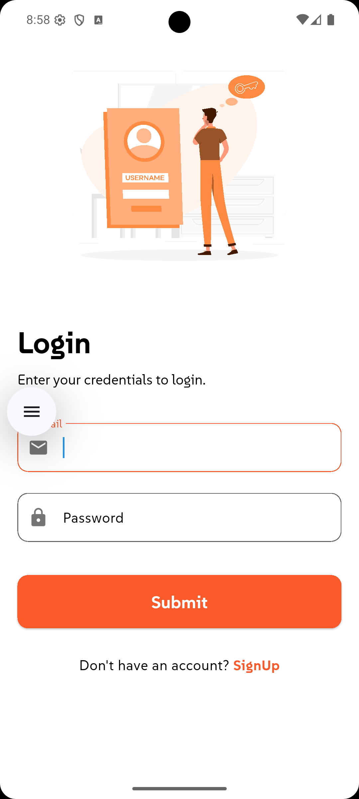
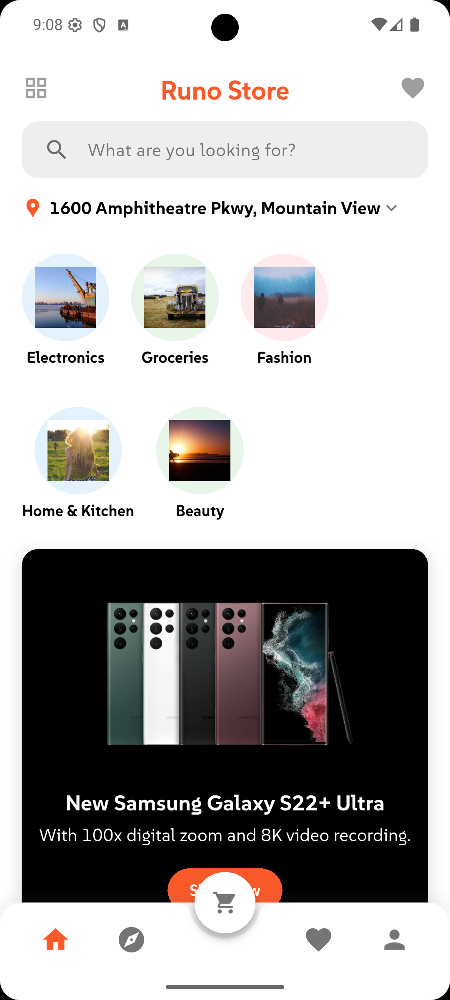
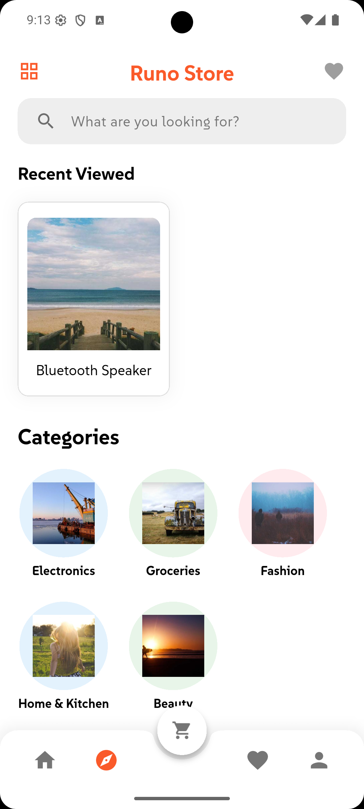
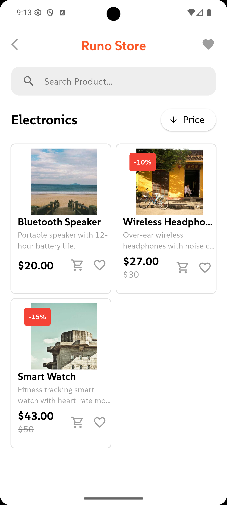
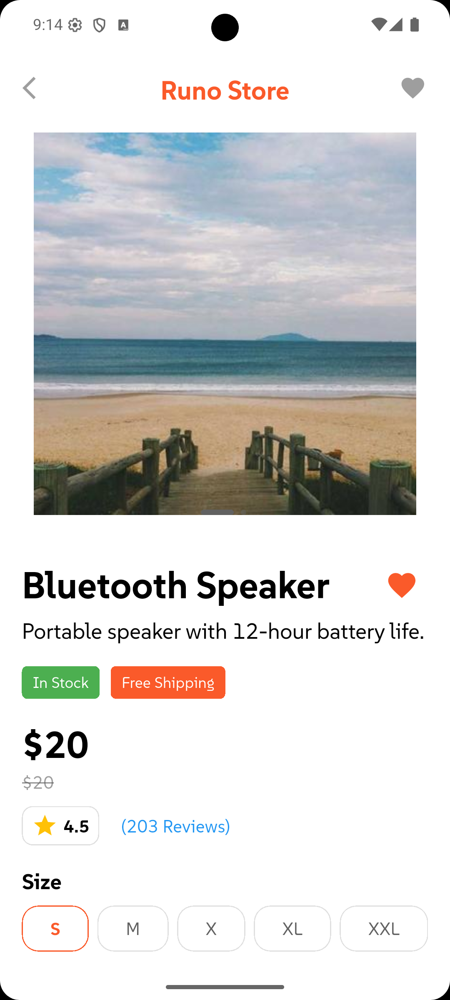
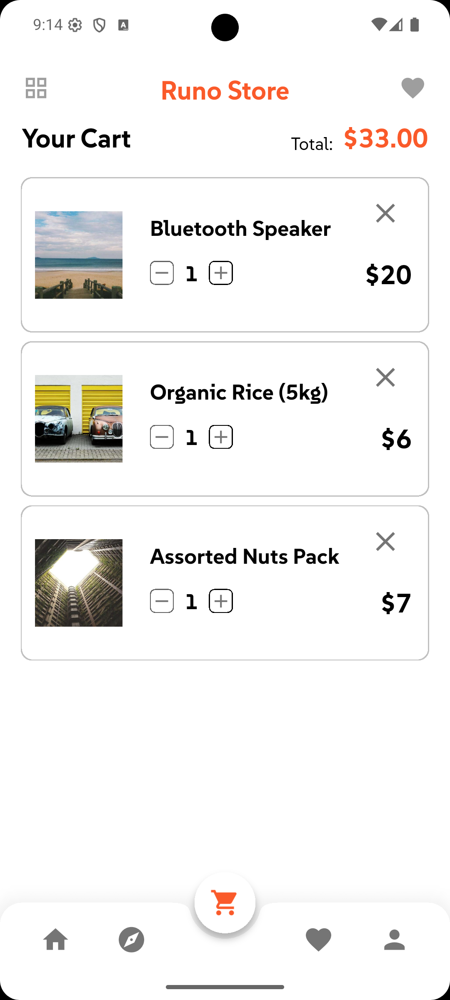

# Flut Mart

A cross-platform e-commerce app built with Flutter. Supports mobile and desktop/web layouts with light and dark themes.

## Screenshots

<table>
  <tr>
    <td align="center"><b>Signup</b></td>
    <td align="center"><b>Login</b></td>
    <td align="center"><b>Home</b></td>
    <td align="center"><b>Explore</b></td>
  </tr>
  <tr>
    <td></td>
    <td></td>
    <td></td>
    <td></td>
  </tr>
  <tr>
    <td align="center"><b>Product List</b></td>
    <td align="center"><b>Product Detail</b></td>
    <td align="center"><b>Cart</b></td>
    <td></td>
  </tr>
  <tr>
    <td></td>
    <td></td>
    <td></td>
    <td></td>
  </tr>
</table>

## Features

- **Authentication** — Login and signup via REST API with JWT token management
- **Home** — Category browsing, image carousel, and product search with history
- **Explore** — Browse and filter all products
- **Product Detail** — Full product view with add-to-cart and favourite actions
- **Cart** — Manage items and quantities
- **Favourites** — Persisted wishlist
- **Profile** — User info display
- **Location** — Live geolocation with map view (flutter_map + geolocator)
- **Responsive Layout** — Adaptive UI for mobile and desktop breakpoints

## Tech Stack

| Concern | Package |
|---|---|
| State management | `provider` |
| Navigation | `go_router` |
| HTTP | `http` |
| Auth tokens | `jwt_decoder`, `shared_preferences` |
| Maps | `flutter_map`, `latlong2`, `geolocator`, `geocoding` |
| Animations | `lottie` |
| Carousel | `carousel_slider` |
| Search suggestions | `flutter_typeahead` |
| Toasts | `toastification` |
| Fonts | `google_fonts`, SUSE (bundled) |

## Project Structure

```
lib/
├── main.dart
├── models/          # Category, Product, User
├── provider/        # CategoryProvider, ProductProvider, LocationProvider, RoutesProvider
├── screens/
│   ├── auth/        # Login, Signup
│   ├── navigation/  # Home, Explore, Cart, Favourite, Profile + Carousel
│   ├── products/    # ProductList, ProductDetail
│   └── splash.dart
├── services/        # Auth, Cart, Category, Favourite, Location, Product, Token
├── utils/
│   ├── constants/   # Colors, Routes, Endpoints, Images
│   ├── helper/      # Responsive breakpoints
│   └── theme/       # Light & dark MaterialTheme
└── widgets/         # Shared UI components
```

## Getting Started

**Prerequisites:** Flutter SDK `^3.5.1`

```bash
# Install dependencies
flutter pub get

# Run on device/emulator
flutter run

# Run on web
flutter run -d chrome

# Build APK
flutter build apk --release
```

## API

The app consumes the following public APIs:

- **Auth & Users** — `https://api.escuelajs.co/api/v1`
- **Categories** — mock endpoint via `mocki.io`
- **Products** — mock endpoint via `mocki.io`
